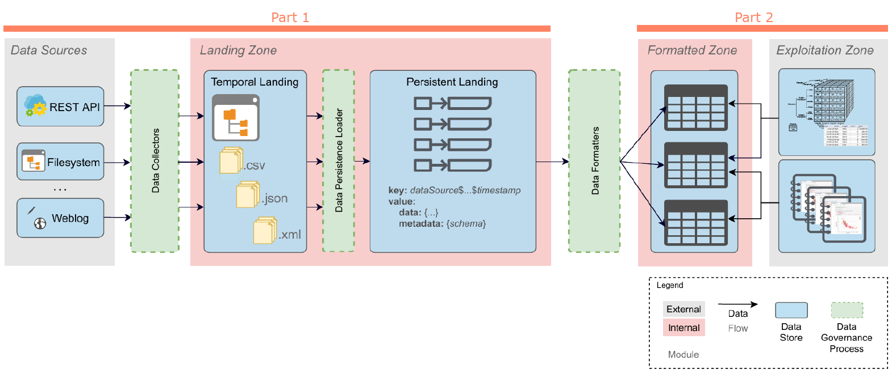
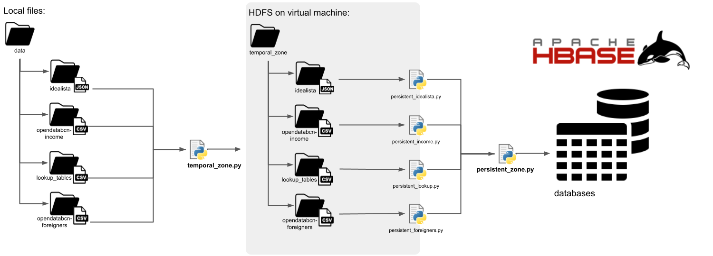
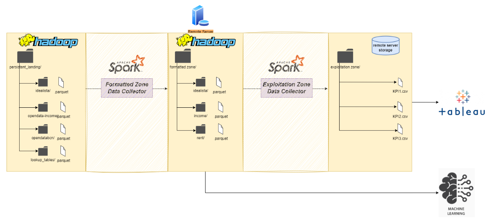

# BDM-BigDataManagement
> A `DataOps system` that deploy `data pipelines` spanning three different areas: `Business understanding`, `Data management` and `Data analysis`. This project is divided into two parts.

**Keywords:** Distributed Data Processing, Stream management and processing, Big Data Architectures, Big Data Design, Distributed Data Management, In-memory Data Management

## Part 1: The Landing zone
Two distributed systems are employed to ingest and store external data.

**The temporal landing** securily stores in the `Hadoop Distributed File System (HDFS)`, acting as a temporary staging area until it's ready for processing. Once processed, the data is transfered to **the persistent landing**, where every data ingested is tracked by both datasource and timestamp. The `HBase`, a high-performance key-value store, tracks the different verions of our data. 

Report of the Part 1: [report.pdf](Part1/report.pdf)

## Part 2: Formatted and Explotation Zone
Here, the persistent landing zone was upgraded to an optimized`HDFS`, storing only `Parquet files` for maximum efficiency and scalability.

In the **The formatted zone** was used `spark RDD` to standardize and reconcile data into a canonical model, ensuring:
* Syntactic & semantic homogenization: Ensuring data consistency across every layer.
* Clean data: Eliminating duplicates for reliable and actionable insights

This feeds into **the exploitation Zone**, where a centralized repository is ready for analysis. In this project it has been created 2 `descriptive KPI's` and 1 `predictive KPI` powered by `machine learning`, enabeling smarter, data-driven decisions.

Report of the Part 2: [report.pdf](Part2/report.pdf)

## Authors
* Part 1: Míriam Méndez, Víctor González
* Part 2: Míriam Méndez, Eliya Tiram
